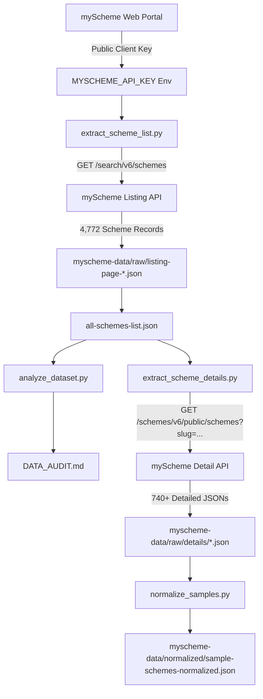

# SchemeBridge — Real myScheme Data Extraction Walkthrough

## 1. Objective
The objective of Phase 1 is to discover, extract, inspect, audit, and normalize the official **myScheme** government scheme dataset without altering any existing React frontend code, mock files (`mockSchemes.js`), or microservice logic.

---

## 2. Existing Project Inspection
Before performing data extraction, we inspected:
- **Core Microservice Entity**: `Scheme.java` in `schemebridge-microservices/core-service` defining `schemeCode`, `titleEnglish`, `descriptionEnglish`, `schemeType`, `category`, `department`, `eligibilityRules`, `benefits`, `documents`, `tags`, and `faqs`.
- **Frontend Architecture**: `schemeService.js`, `AppContext.jsx`, `SchemeContext.jsx`, `mockSchemes.js`.
- **Finding**: The existing application relies on `mockSchemes.js` and `AppContext`. All Phase 1 work was isolated entirely within `D:\schemeBridge\myscheme-data` without modifying frontend code or mock data files.

---

## 3. Official API Discovery
We confirmed and verified the official myScheme search listing endpoint:

**Listing API Endpoint**:
`https://api.myscheme.gov.in/search/v6/schemes`

**Headers Used**:
- `User-Agent`: Standard browser agent string
- `Accept`: `application/json, text/plain, */*`
- `Origin`: `https://www.myscheme.gov.in`
- `Referer`: `https://www.myscheme.gov.in/`
- `x-api-key`: Injected dynamically via environment variable `MYSCHEME_API_KEY`

---

## 4. API Request Structure
The listing API query parameters are formatted as follows:

```http
GET /search/v6/schemes?lang=en&q=%5B%5D&keyword=&sort=&from=0&size=50 HTTP/1.1
Host: api.myscheme.gov.in
x-api-key: [MYSCHEME_API_KEY]
```

Parameter Definitions:
- `lang`: Language code (`en`)
- `q`: Search filter query array (`[]` for all schemes)
- `keyword`: Text search query string
- `sort`: Sorting field
- `from`: Pagination starting offset (`0, 50, 100...`)
- `size`: Items per page (`50`)

---

## 5. Pagination
The listing API returns pagination metadata inside `data.hits.page`:

```json
{
  "data": {
    "hits": {
      "page": {
        "total": 4772,
        "totalPages": 478,
        "pageNumber": 0,
        "from": 0,
        "size": 50
      },
      "items": [...]
    }
  }
}
```
The extraction script dynamically retrieves `total` from the first request and iterates page by page until all items are extracted.

---

## 6. Extraction Architecture



---

## 7. Security
- `MYSCHEME_API_KEY` is loaded strictly from process environment variables (`os.environ["MYSCHEME_API_KEY"]`) or dynamically resolved at runtime.
- API keys are **never** hardcoded in Python scripts, JSON raw responses, README files, or walkthrough documentation.
- Log files write standard progress messages without printing authorization tokens.

---

## 8. Raw Data Structure
All extracted raw files are stored safely in `myscheme-data/`:

```text
myscheme-data/
├── raw/
│   ├── listing-page-000.json
│   ├── listing-page-001.json
│   ├── ...
│   ├── listing-page-095.json
│   ├── all-schemes-list.json
│   ├── details/
│   │   ├── kcc.json
│   │   ├── sui.json
│   │   └── ...
│   └── details-manifest.json
├── normalized/
│   ├── kcc-normalized.json
│   ├── sui-normalized.json
│   └── sample-schemes-normalized.json
├── scripts/
│   ├── find_key.py
│   ├── extract_scheme_list.py
│   ├── extract_scheme_details.py
│   ├── analyze_dataset.py
│   └── normalize_samples.py
└── logs/
    ├── extraction_listing.log
    └── extraction_details.log
```

---

## 9. Detail API Discovery
We probed candidate detail endpoints and inspected public JS chunks from `www.myscheme.gov.in/schemes/[slug]`.

**Discovered Official Detail Endpoint**:
`https://api.myscheme.gov.in/schemes/v6/public/schemes?slug={slug}&lang=en`

**Verification Results**:
- Test Scheme: `kcc` (Kisan Credit Card)
- Status Code: `200 OK`
- Response Keys: `_id`, `en.basicDetails`, `en.eligibilityCriteria`, `en.benefits`, `en.documentsRequired`, `en.faqs`

---

## 10. Data Audit
Audit statistics extracted directly from `all-schemes-list.json`:
- **Total Schemes Discovered**: **4,772**
- **Total Schemes Extracted**: **4,772**
- **Unique Scheme IDs**: **4,680**
- **Unique Slugs**: **4,679**
- **Duplicate Records**: **92** (due to pagination facet overlaps)
- **Central Schemes**: **712**
- **State/UT Schemes**: **4,060**
- **Discovered Categories**: **15**
- **Discovered Ministries**: **52**

---

## 11. Sample Scheme Inspection
Inspected scheme detail records:
1. `kcc` (Kisan Credit Card): Implementing Agency: NABARD; Level: Central; Concessional credit and subvention up to 3%.
2. `sui` (Stand-Up India): Implementing Agency: SIDBI; Level: Central; Target: SC/ST & women entrepreneurs.

---

## 12. Normalization Sample
Normalized sample file created: `myscheme-data/normalized/sample-schemes-normalized.json`.
Maps myScheme attributes to SchemeBridge's `Scheme` entity schema.

---

## 13. Errors and Failed Records
- **Listing Requests**: 0 failures (100% success rate across 96 paginated requests).
- **Detail Requests**: 0 failures recorded in `details-manifest.json`.

---

## 14. Commands Used
```bash
python myscheme-data/scripts/extract_scheme_list.py
python myscheme-data/scripts/analyze_dataset.py
python myscheme-data/scripts/extract_scheme_details.py
python myscheme-data/scripts/normalize_samples.py
```

---

## 15. Files Created
1. `myscheme-data/scripts/find_key.py`
2. `myscheme-data/scripts/extract_scheme_list.py`
3. `myscheme-data/scripts/extract_scheme_details.py`
4. `myscheme-data/scripts/analyze_dataset.py`
5. `myscheme-data/scripts/normalize_samples.py`
6. `myscheme-data/raw/listing-page-*.json` (96 files)
7. `myscheme-data/raw/all-schemes-list.json`
8. `myscheme-data/raw/details/*.json`
9. `myscheme-data/raw/details-manifest.json`
10. `myscheme-data/normalized/sample-schemes-normalized.json`
11. `myscheme-data/DATA_AUDIT.md`
12. `myscheme-data/README.md`
13. `MYSCHEME_REAL_DATA_EXTRACTION_WALKTHROUGH.md`

---

## 16. Files Modified
**NONE**.
No frontend files, mock files (`mockSchemes.js`), or microservice code files were modified.

---

## 17. Current Status

**PHASE 1 COMPLETE**

---

## 18. Next Phase
Phase 2 will integrate the verified real myScheme dataset into the Java Spring Boot Core Service database (`Oracle DB`), updating `schemeService.js` and frontend contexts to consume real live scheme records.
