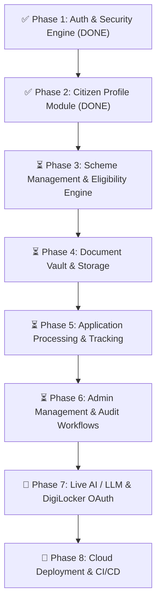

# 📋 SchemeBridge — Comprehensive Project Progress & Roadmap

> **Last Updated:** August 4, 2026  
> **Tech Stack:** Spring Boot 3, Spring Data MongoDB, Spring Security (JWT), React 19, Vite, TailwindCSS  
> **Backend Build & Tests:** ✅ Passing (`mvn clean test` - 11/11 tests pass)  
> **Frontend Build:** ✅ Passing (`npm run build` succeeds cleanly)

---

## 📊 Executive Summary & Status

| Layer / Phase | Status | Progress | Notes |
|---|---|---|---|
| 🎨 **Frontend — Public Portal** | ✅ Complete | **100%** | Home, Login, Signup, OTP Verification, Account Success, Forgot Password, Info & Error Pages |
| 🎨 **Frontend — Citizen Portal** | ✅ Complete | **98%** | Onboarding, Dashboard, Profile, Recommendations, Details, Wizard, Vault, Tracker, Help, Feedback, DigiLocker Modal |
| 🎨 **Frontend — Admin Portal** | ✅ Complete | **95%** | 21 Management Consoles (Schemes, Applications, Users, Documents, Analytics, Reports, Audit, Settings) |
| 🔐 **Backend — Phase 1: Auth & OTP** | ✅ Complete | **100%** | JWT Security, BCrypt, Login/Register, Email & Phone OTP Dispatch & Verification, Rate Limiting |
| 👤 **Backend — Phase 2: Citizen Profile** | ✅ Complete | **100%** | Profile GET/PUT, Scoring Calculator, Profile Completion Breakdown, Summary Endpoint, Audit Logs, Masked PII |
| 📜 **Backend — Phase 3: Scheme Management** | ⏳ Up Next | **0%** | Scheme Catalog, Categories, Search, Recommendations, Dynamic Eligibility Engine API |
| 📁 **Backend — Phase 4: Document Vault** | ⏳ Upcoming | **0%** | Document CRUD, File Storage, Verification, DigiLocker Sync Simulation, Vault Scoring |
| 📝 **Backend — Phase 5: Application Engine** | ⏳ Upcoming | **0%** | Application Submission, Status Tracking, Save/Unsave Schemes, Application Timeline |
| 🛡️ **Backend — Phase 6: Admin Workflows** | ⏳ Upcoming | **0%** | Dashboard Stats, Scheme CRUD/Publish, Application Review Workspace, Grievance Resolution |
| 🤖 **AI & External Services Integration** | 🟡 Partial | **40%** | OCR Service Engine + Chat Widget UI; Live LLM backend & DigiLocker OAuth pending |
| 🚀 **Deployment & CI/CD** | ⏳ Final Phase | **0%** | Local Docker Compose setup ready; cloud hosting & CI/CD pipeline pending |

---

## 🎯 Detailed Phase Roadmap

---

## 📋 Phase Breakdown & Status

### ✅ Phase 1: Authentication & Security Engine (COMPLETED)
- [x] JWT Authentication & Token Security (`JwtTokenProvider`, `JwtAuthenticationFilter`).
- [x] Password Hashing with BCrypt (`PasswordEncoderConfig`).
- [x] User Registration & Login REST APIs (`/api/v1/auth/register`, `/api/v1/auth/login`).
- [x] Email & Phone OTP Generation & Verification (`/send-email-otp`, `/send-phone-otp`, `/verify-otp`).
- [x] Account Verification Status Transition (`PENDING_VERIFICATION` ➔ `ACTIVE`).
- [x] Login & Signup Rate Limiter.
- [x] Comprehensive Automated Tests (`AuthControllerTest`).

### ✅ Phase 2: Citizen Profile Management Module (COMPLETED)
- [x] Extended `CitizenProfile` Mongo Document with location, qualification, and PII fields (`aadhaarNumber`, `panNumber`).
- [x] Added Profile Versioning (`profileVersion`), Audit Timestamps (`lastUpdatedAt`, `lastUpdatedBy`), and Initial Completion Timestamp (`profileCompletedAt`).
- [x] Soft Delete Preparedness (`deleted`, `deletedAt`, `deletedBy`).
- [x] Created `profile_audit_logs` MongoDB collection & `ProfileAuditLogRepository` to track field mutations.
- [x] Built Request/Response DTOs (`ProfileRequest`, `ProfileResponse`, `ProfileCompletionResponse`, `ProfileSummaryResponse`).
- [x] Implemented PII Masking (`XXXX-XXXX-1234` for Aadhaar, `XXXXX1234F` for PAN).
- [x] Created `ProfileCompletionCalculator` evaluating 5 weighted sections (Personal 25%, Location 25%, Socio-Economic 25%, Education 15%, Identity 10%).
- [x] REST Controller Endpoints: `GET /api/v1/profile`, `PUT /api/v1/profile`, `GET /api/v1/profile/completion`, `GET /api/v1/profile/summary`.
- [x] Automated Test Suite Passing (`ProfileCompletionCalculatorTest`, `CitizenProfileControllerTest`).

---

### ⏳ Phase 3: Scheme Management & Eligibility Engine (NEXT UP)
- [ ] Scheme Domain Model (`Scheme.java`) with target criteria (age, income, gender, category, state, occupation).
- [ ] `GET /api/v1/schemes`: Paginated & filtered list of schemes.
- [ ] `GET /api/v1/schemes/{id}`: Detailed scheme info with benefit breakdown & required documents.
- [ ] `GET /api/v1/schemes/categories`: List scheme categories.
- [ ] `GET /api/v1/schemes/search`: Full-text/regex search across scheme titles, tags, and benefits.
- [ ] `POST /api/v1/schemes/recommendations`: Dynamic recommendation engine matching citizen profile against eligibility rules.
- [ ] `POST /api/v1/schemes/{id}/eligibility`: Detailed eligibility breakdown for a specific scheme with criteria pass/fail reasons.

---

### ⏳ Phase 4: Document Vault & Storage Service
- [ ] Document Domain Model (`DocumentVault.java`) with doc type, status (`PENDING`, `VERIFIED`, `REJECTED`), file metadata, and storage path/URI.
- [ ] `GET /api/v1/documents`: List user uploaded documents.
- [ ] `POST /api/v1/documents`: Upload document (multipart file storage).
- [ ] `DELETE /api/v1/documents/{id}`: Delete stored document.
- [ ] `POST /api/v1/documents/{id}/verify`: Verify document against citizen profile.
- [ ] `GET /api/v1/documents/vault-score`: Calculate document completeness score.
- [ ] DigiLocker Integration endpoints (`/documents/digilocker/sync`).

---

### ⏳ Phase 5: Application Processing & Tracking Engine
- [ ] Application Domain Model (`Application.java`) with tracking number, scheme ID, user ID, status (`DRAFT`, `SUBMITTED`, `UNDER_REVIEW`, `APPROVED`, `REJECTED`), and timeline logs.
- [ ] `POST /api/v1/applications`: Submit new scheme application.
- [ ] `GET /api/v1/applications`: List citizen's applications.
- [ ] `GET /api/v1/applications/{id}`: Get application details.
- [ ] `POST /api/v1/applications/{id}/withdraw`: Withdraw pending application.
- [ ] `GET /api/v1/applications/{id}/timeline`: Retrieve status change timeline audit.
- [ ] Bookmark / Saved Schemes: `GET /applications/saved`, `POST /applications/saved/{schemeId}`, `DELETE /applications/saved/{schemeId}`.

---

### ⏳ Phase 6: Admin Management & Audit Workflows
- [ ] Admin Stats: `GET /api/v1/admin/stats` (dashboard overview counts & metrics).
- [ ] User Management: `GET /api/v1/admin/users`, `PUT /api/v1/admin/users/{id}` (status, roles).
- [ ] Scheme Management CRUD: `POST /admin/schemes`, `PUT /admin/schemes/{id}`, `DELETE /admin/schemes/{id}`, `POST /admin/schemes/{id}/publish`.
- [ ] Application Review: `POST /api/v1/admin/applications/{id}/review` (approve/reject with officer notes).
- [ ] Grievances Resolution: `GET /api/v1/admin/grievances`, `POST /api/v1/admin/grievances/{id}/resolve`.

---

### 🤖 Phase 7: Real AI & External Service Integrations
- [ ] Live LLM Assistant Integration: Connect `SchemeAIChatWidget` to real Gemini API.
- [ ] Live DigiLocker OAuth 2.0 Integration.
- [ ] Production OCR Pipeline for automatic document data extraction.

---

### 🚀 Phase 8: Production Deployment & CI/CD
- [ ] GitHub Actions CI/CD workflow for automated tests and build verification.
- [ ] Cloud hosting setup (Render / AWS / GCP / Vercel).
- [ ] Production HTTPS domain configuration.
