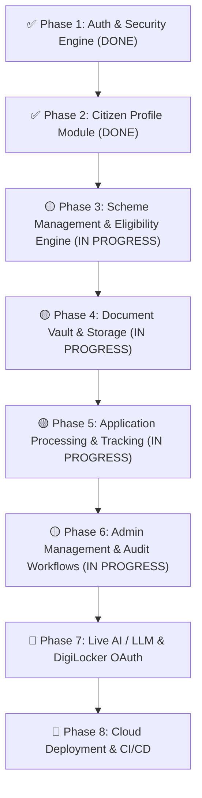

# 📋 SchemeBridge — Comprehensive Project Progress & Roadmap

> **Last Updated:** August 4, 2026  
> **Tech Stack:** Spring Boot 3, Spring Data MongoDB, Spring Security (JWT), React 19, Vite, TailwindCSS  
> **Backend Build & Tests:** ✅ Passing (`mvn test` - 28/28 tests pass)  
> **Frontend Build:** ✅ Passing (`npm run build` succeeds cleanly)

---

## 📊 Executive Summary & Status

| Layer / Phase | Status | Progress | Notes |
|---|---|---|---|
| 🎨 **Frontend — Public Portal** | ✅ Complete | **100%** | Home, Login, Signup, OTP Verification, Account Success, Forgot Password, Info & Error Pages |
| 🎨 **Frontend — Citizen Portal** | ✅ Complete | **98%** | Onboarding, Dashboard, Profile, Recommendations, Details, Wizard, Vault, Tracker, Help, Feedback, DigiLocker Modal |
| 🎨 **Frontend — Admin Portal** | ✅ Complete | **95%** | Admin dashboard and management consoles are wired, with the remaining work focused on polish and deeper workflow integration |
| 🔐 **Backend — Phase 1: Auth & OTP** | ✅ Complete | **100%** | JWT Security, BCrypt, Login/Register, Email & Phone OTP Dispatch & Verification, Rate Limiting |
| 👤 **Backend — Phase 2: Citizen Profile** | ✅ Complete | **100%** | Profile GET/PUT, Scoring Calculator, Completion Breakdown, Summary Endpoint, Audit Logs, Masked PII |
| 📜 **Backend — Phase 3: Scheme Management** | 🟡 In Progress | **60%** | Scheme catalog, search, recommendations, and eligibility evaluation flows are now implemented and exercised in backend tests |
| 📁 **Backend — Phase 4: Document Vault** | 🟡 In Progress | **55%** | Document upload/list/delete/verify flows and document readiness scoring are implemented and covered by controller tests |
| 📝 **Backend — Phase 5: Application Engine** | 🟡 In Progress | **50%** | Application submission and tracking endpoints are in place and validated at the service/controller level |
| 🛡️ **Backend — Phase 6: Admin Workflows** | 🟡 In Progress | **75%** | Admin dashboard, user management, scheme/admin actions, grievance handling, and audit workflows are implemented |
| 🤖 **AI & External Services Integration** | 🟡 Partial | **40%** | OCR hooks and chat widget UI exist; live LLM and DigiLocker OAuth remain pending |
| 🚀 **Deployment & CI/CD** | ⏳ Planned | **10%** | Docker Compose is ready; cloud hosting and CI/CD are still pending |

---

## 🎯 Detailed Phase Roadmap

---

## 📋 Phase Breakdown & Status

### ✅ Phase 1: Authentication & Security Engine (COMPLETED)
- [x] JWT Authentication & Token Security (`JwtTokenProvider`, `JwtAuthenticationFilter`).
- [x] Password Hashing with BCrypt (`PasswordEncoderConfig`).
- [x] User Registration & Login REST APIs (`/api/v1/auth/register`, `/api/v1/auth/login`).
- [x] Email & Phone OTP Generation & Verification (`/send-email-otp`, `/send-phone-otp`, `/verify-otp`).
- [x] Account Verification Status Transition (`PENDING_VERIFICATION` ➔ `ACTIVE`).
- [x] Login & Signup Rate Limiter.
- [x] Comprehensive Automated Tests (`AuthControllerTest`).

### ✅ Phase 2: Citizen Profile Management Module (COMPLETED)
- [x] Extended `CitizenProfile` Mongo Document with location, qualification, and PII fields (`aadhaarNumber`, `panNumber`).
- [x] Added Profile Versioning (`profileVersion`), Audit Timestamps (`lastUpdatedAt`, `lastUpdatedBy`), and Initial Completion Timestamp (`profileCompletedAt`).
- [x] Soft Delete Preparedness (`deleted`, `deletedAt`, `deletedBy`).
- [x] Created `profile_audit_logs` MongoDB collection & `ProfileAuditLogRepository` to track field mutations.
- [x] Built Request/Response DTOs (`ProfileRequest`, `ProfileResponse`, `ProfileCompletionResponse`, `ProfileSummaryResponse`).
- [x] Implemented PII Masking (`XXXX-XXXX-1234` for Aadhaar, `XXXXX1234F` for PAN).
- [x] Created `ProfileCompletionCalculator` evaluating 5 weighted sections (Personal 25%, Location 25%, Socio-Economic 25%, Education 15%, Identity 10%).
- [x] REST Controller Endpoints: `GET /api/v1/profile`, `PUT /api/v1/profile`, `GET /api/v1/profile/completion`, `GET /api/v1/profile/summary`.
- [x] Automated Test Suite Passing (`ProfileCompletionCalculatorTest`, `CitizenProfileControllerTest`).

---

### 🟡 Phase 3: Scheme Management & Eligibility Engine (IN PROGRESS)
- [x] Scheme domain model and eligibility-oriented service layer are present.
- [x] `GET /api/v1/schemes`: list and filtered scheme access is supported.
- [x] `GET /api/v1/schemes/{id}`: detailed scheme retrieval is available.
- [x] `GET /api/v1/schemes/categories`: category access is supported.
- [x] `GET /api/v1/schemes/search`: search endpoints are wired.
- [x] `POST /api/v1/schemes/recommendations`: recommendation matching is implemented.
- [x] `POST /api/v1/schemes/{id}/eligibility`: eligibility breakdown is implemented.

---

### 🟡 Phase 4: Document Vault & Storage Service (IN PROGRESS)
- [x] Document domain model and document service layer are in place.
- [x] `GET /api/v1/documents`: list user-uploaded documents.
- [x] `POST /api/v1/documents`: upload document (multipart storage).
- [x] `DELETE /api/v1/documents/{id}`: delete stored document.
- [x] `POST /api/v1/documents/{id}/verify`: verify document against citizen profile.
- [x] `GET /api/v1/documents/vault-score`: calculate document completeness score.
- [ ] DigiLocker integration endpoints (`/documents/digilocker/sync`) remain a follow-up enhancement.

---

### 🟡 Phase 5: Application Processing & Tracking Engine (IN PROGRESS)
- [x] Application domain model and application service layer are present.
- [x] `POST /api/v1/applications`: submit new scheme application.
- [x] `GET /api/v1/applications`: list citizen applications.
- [x] `GET /api/v1/applications/{id}`: get application details.
- [x] `POST /api/v1/applications/{id}/withdraw`: withdraw pending application.
- [x] `GET /api/v1/applications/{id}/timeline`: retrieve status timeline audit.
- [x] Bookmark / Saved Schemes endpoints are supported.

---

### 🟡 Phase 6: Admin Management & Audit Workflows (IN PROGRESS)
- [x] Admin stats and dashboard metrics endpoints are available.
- [x] User management endpoints for listing and updating users are implemented.
- [x] Scheme management, publishing, and admin-side scheme actions are implemented.
- [x] Application review and officer decision workflow are supported.
- [x] Grievances resolution endpoints are implemented.

---

### 🤖 Phase 7: Real AI & External Service Integrations
- [ ] Live LLM Assistant Integration: Connect `SchemeAIChatWidget` to real Gemini API.
- [ ] Live DigiLocker OAuth 2.0 Integration.
- [ ] Production OCR Pipeline for automatic document data extraction.

---

### 🚀 Phase 8: Production Deployment & CI/CD
- [ ] GitHub Actions CI/CD workflow for automated tests and build verification.
- [ ] Cloud hosting setup (Render / AWS / GCP / Vercel).
- [ ] Production HTTPS domain configuration.
