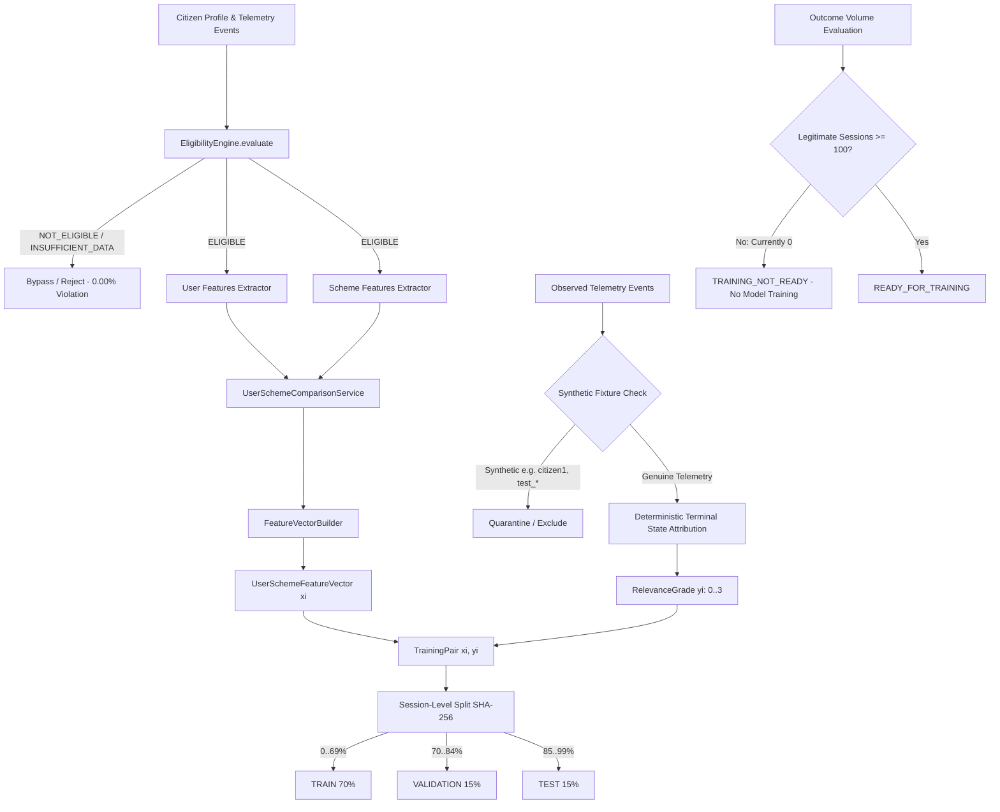

# PHASE 27 — OFFLINE INTERACTION-TO-OUTCOME ATTRIBUTION, MULTI-LEVEL RELEVANCE LABELING & LTR DATASET PIPELINE

## 1. Executive Summary

Phase 27 establishes the deterministic, explainable, and privacy-preserving Learning-to-Rank (LTR) dataset attribution pipeline for SchemeBridge. Building directly on the User-Scheme Feature Vector architecture established in Phase 26, Phase 27 converts genuine citizen interaction telemetry into verified training pairs $(x_i, y_i)$ ready for future supervised LTR ranking models once sufficient legitimate outcome telemetry exists.

**Core Operational Invariants:**
1. **Statutory Eligibility First Gate**: `EligibilityEngine.evaluate() == ELIGIBLE` is the mandatory first gate. No feature vector, relevance label, or training pair is ever generated for a scheme that fails statutory eligibility (`STATUTORY_ELIGIBILITY_VIOLATION_RATE = 0.00%`).
2. **Production MongoDB Strict Read-Only**: Read-only access enforced (`INSERT=0, UPDATE=0, DELETE=0, DROP=0`).
3. **Zero Data Fabrication**: No synthetic clicks, applications, feedback, or labels are manufactured. With 0 legitimate outcome sessions, training readiness remains strictly `TRAINING_NOT_READY`.
4. **Permanent Quarantine of Historical Synthetic Fixtures**: All 29 historical `application_events` generated during automated test suites are permanently excluded from all training data and evaluation.
5. **Zero-PII Telemetry Protection**: All explicit fields and arbitrary metadata keys are checked and sanitized against forbidden PII keywords.
6. **Deterministic Terminal-State Relevance Attribution**: Monotonically resolves session events to the highest legitimately observed grade without fabricating unobserved outcomes.
7. **Session-Level Isolation (0.00% Leakage)**: Sessions are split into TRAIN (70%), VALIDATION (15%), and TEST (15%) strictly at the `sessionId` level using SHA-256 hashing.
8. **Active Model Unchanged**: The production recommendation model remains `2.2.0-hybrid-semantic-384d`, backed by `1.0.0-deterministic` fallback and the 200 ms circuit breaker.

---

## 2. End-to-End Pipeline Architecture

---

## 3. Multi-Level Relevance Labeling Specification

Relevance grading is terminal-state based and deterministic:

| Grade | Canonical Level | Triggering Interaction Events | Behavioral Meaning |
| :---: | :--- | :--- | :--- |
| **0** | `IMPRESSED_UNENGAGED` | `RECOMMENDATION_SHOWN` | Scheme was presented in recommendations but citizen did not click or expand. |
| **1** | `VIEWED` | `SCHEME_VIEWED`, `SCHEME_EXPANDED` | Citizen showed initial interest by reading details or expanding scheme criteria. |
| **2** | `INTENT_HIGH` | `SCHEME_SAVED`, `APPLICATION_STARTED` | Citizen demonstrated strong intent by bookmarking scheme or initiating application wizard. |
| **3** | `CONVERTED` | `SCHEME_APPLIED`, `APPLICATION_COMPLETED` | Citizen completed and submitted formal statutory scheme application. |

### Monotonic Terminal-State Resolution
Session events are processed in chronological order. Terminal state is monotonic:
$$\text{Grade}_{\text{terminal}} = \max_{e \in \text{ObservedEvents}} \text{Grade}(e)$$
A later lower event (e.g. returning to the recommendation list and triggering `RECOMMENDATION_SHOWN`) never regresses the terminal grade. Critically, later events never manufacture an outcome that was never observed.

---

## 4. Session-Level Split Isolation & Leakage Prevention

- Splitting uses a deterministic SHA-256 hash of `sessionId` modulo 100:
  - `0 <= bucket < 70` $\rightarrow$ `TRAIN` (70%)
  - `70 <= bucket < 85` $\rightarrow$ `VALIDATION` (15%)
  - `85 <= bucket < 100` $\rightarrow$ `TEST` (15%)
- **Session-Level Isolation Guarantee**:
  $$\text{TRAIN} \cap \text{VALIDATION} = \emptyset, \quad \text{TRAIN} \cap \text{TEST} = \emptyset, \quad \text{VALIDATION} \cap \text{TEST} = \emptyset$$
- Splitting by `schemeCode` alone is explicitly prohibited; session isolation guarantees zero data leakage across splits.

---

## 5. Synthetic Fixture Quarantine Policy

- All 29 historical `application_events` in MongoDB were generated during test suite execution (`applicationId = 6a952810c6037907f0030c06`, `userId = citizen_user`, `citizen1`, `test_citizen`).
- These fixtures are strictly quarantined by `SessionAttributionService.isSyntheticFixture()` and excluded from dataset construction.
- Zero fake records are generated to fill the dataset.

---

## 6. Zero-PII Telemetry Protection

- All interaction telemetry models enforce strict sanitization:
  `aadhaar`, `uid`, `pan`, `phone`, `mobile`, `email`, `name`, `firstname`, `lastname`, `address`, `street`, `ip`, `location`, `pincode`, `udid`.
- Stripping occurs before storage and before feature vector or training pair generation.
