# Phase 2A — Mapping & Analysis Walkthrough

## 1. Objective
The objective of Phase 2A is to perform an exhaustive analysis of the 4,679 real myScheme detail JSON files and define the exact data mapping into SchemeBridge's Java `core-service` domain model and Oracle database schema, without altering frontend code, microservices logic, database tables, or mock data.

---

## 2. Dataset Structure
- **Dataset Directory**: `D:\schemeBridge\myscheme-data\raw\details`
- **Total Detail Files**: 4,679 JSON files (100% verified coverage).
- **JSON Structure**:
  - `data._id`: Primary unique identifier
  - `data.slug`: URL slug string
  - `data.en.basicDetails`: Metadata (name, short title, level, state, category, department, DBT status, tags)
  - `data.en.schemeContent`: Brief description & overview
  - `data.en.benefits`: Scheme benefits list
  - `data.en.eligibilityCriteria`: Eligibility requirements text/rules
  - `data.en.applicationProcess`: Step-by-step application instructions
  - `data.en.faqs`: Frequently Asked Questions list

---

## 3. Existing Core Service Structure
The `core-service` Java microservice defines the domain model across 8 JPA Entity classes:
1. `Scheme.java` (Table: `SCHEMES`)
2. `SchemeCategory.java` (Table: `SCHEME_CATEGORIES`)
3. `SchemeDepartment.java` (Table: `SCHEME_DEPARTMENTS`)
4. `SchemeBenefit.java` (Table: `SCHEME_BENEFITS`)
5. `SchemeEligibilityRule.java` (Table: `SCHEME_ELIGIBILITY_RULES`)
6. `SchemeDocument.java` (Table: `SCHEME_DOCUMENTS`)
7. `SchemeFaq.java` (Table: `SCHEME_FAQS`)
8. `SchemeTag.java` (Table: `SCHEME_TAGS`)

---

## 4. MyScheme Schema Analysis
The raw myScheme JSON data is rich and structured, with 100% presence for core attributes (`schemeName`, `briefDescription`, `benefits`, `eligibilityCriteria`, `applicationProcess`, `schemeCategory`).

---

## 5. SchemeBridge Schema Analysis
The existing SchemeBridge schema supports most core fields. However, four myScheme attributes (`slug`, `applicationProcess`, `dbtScheme`, `targetBeneficiaries`) do not currently have corresponding columns on the `SCHEMES` table.

---

## 6. Field Mapping Summary

```mermaid
flowchart TD
    subgraph myScheme Raw JSON
        A["data._id"]
        B["basicDetails.schemeShortTitle"]
        C["basicDetails.schemeName"]
        D["basicDetails.briefDescription"]
        E["basicDetails.level"]
        F["basicDetails.schemeCategory"]
        G["basicDetails.nodalMinistryName"]
        H["benefits"]
        I["eligibilityCriteria"]
        J["applicationProcess"]
        K["faqs"]
    end

    subgraph SchemeBridge Core Service
        A1["Scheme.id (SCHEMES.ID)"]
        B1["Scheme.schemeCode (SCHEMES.SCHEME_CODE)"]
        C1["Scheme.titleEnglish (SCHEMES.TITLE_ENGLISH)"]
        D1["Scheme.descriptionEnglish (SCHEMES.DESCRIPTION_ENGLISH)"]
        E1["Scheme.schemeType (SCHEMES.SCHEME_TYPE)"]
        F1["SchemeCategory (SCHEME_CATEGORIES)"]
        G1["SchemeDepartment (SCHEME_DEPARTMENTS)"]
        H1["List<SchemeBenefit> (SCHEME_BENEFITS)"]
        I1["List<SchemeEligibilityRule> (SCHEME_ELIGIBILITY_RULES)"]
        J1["Scheme.applicationProcess (SCHEMES.APPLICATION_PROCESS)"]
        K1["List<SchemeFaq> (SCHEME_FAQS)"]
    end

    A -->|Direct| A1
    B -->|Transform| B1
    C -->|Direct| C1
    D -->|HTML Clean| D1
    E -->|Map Enum| E1
    F -->|FK Lookup| F1
    G -->|FK Lookup| G1
    H -->|Normalize List| H1
    I -->|Normalize List| I1
    J -->|HTML Clean| J1
    K -->|Normalize List| K1
```

---

## 7. Transformation Rules
1. **HTML Sanitization**: All rich text fields (`description`, `benefits`, `applicationProcess`) are stripped of HTML tags (`clean_html`) for clean display in the React frontend.
2. **Category / Department Foreign Key Resolution**: Categories (15 total) and Departments/Ministries (52 total) are dynamically looked up by name or created on-the-fly in `SCHEME_CATEGORIES` and `SCHEME_DEPARTMENTS`.
3. **Level Normalization**: Values mapped to `"CENTRAL"` or `"STATE"`.

---

## 8. Data Gaps
- **New Table Columns**: `SLUG`, `APPLICATION_PROCESS`, `DBT_SCHEME`, `TARGET_BENEFICIARIES` to be added in Phase 2B import.
- **Embedded Documents**: Document requirements embedded in application text normalized into `SCHEME_DOCUMENTS`.

---

## 9. Database Impact
The existing Oracle database schema can represent 95% of the data directly. Adding 4 new columns (`SLUG`, `APPLICATION_PROCESS`, `DBT_SCHEME`, `TARGET_BENEFICIARIES`) to `SCHEMES` table in Phase 2B will achieve 100% native representation.

---

## 10. Sample Normalization
Generated sample file: [phase2-sample.json](file:///d:/schemeBridge/myscheme-data/normalized/phase2-sample.json) containing 10 representative normalized scheme records (KCC, Stand-Up India, PM-KISAN, PMAY-U, APY, PMUY, Ayushman Bharat, MGNREGA, Sukanya Samriddhi, Puducherry Merit Grant).

---

## 11. Data-Quality Results

| Metric | Value |
|---|---|
| **Total Files Inspected** | **4,679** |
| **Missing Scheme Names** | **0** (0.0%) |
| **Missing Descriptions** | **0** (0.0%) |
| **Missing Benefits** | **0** (0.0%) |
| **Missing Eligibility Criteria** | **0** (0.0%) |
| **Missing Application Process** | **0** (0.0%) |
| **Missing Scheme Category** | **0** (0.0%) |
| **Missing Separate Document List** | **4,675** (Embedded in application process text) |
| **Missing Central Ministry Name** | **2,752** (State schemes use state/department names) |
| **Inconsistent JSON Shapes** | **4** (0.08%) |

---

## 12. Recommended Import Architecture
1. **Idempotent Seeder Component**: Build a Spring Boot `DataSeeder` or Java import utility inside `core-service` that reads `all-schemes-list.json` and `raw/details/*.json`.
2. **Batch Transaction Management**: Insert records in batches of 100 schemes per transaction to ensure optimal Oracle DB performance.
3. **Child Table Cascade**: Automatically insert child rows for `SCHEME_BENEFITS`, `SCHEME_ELIGIBILITY_RULES`, `SCHEME_TAGS`, `SCHEME_DOCUMENTS`, and `SCHEME_FAQS`.

---

## 13. Risks
- **Data Volume**: Importing 4,679 schemes + ~25,000 child rows into Oracle DB requires batching to avoid transaction timeouts.
- **FK Constraints**: Categories and Departments must be seeded first before `SCHEMES` records are inserted.

---

## 14. Next Implementation Step
Proceed to **Phase 2B: Controlled Database Import** to create the migration utility and seed the 4,679 real myScheme records into the Oracle database.
